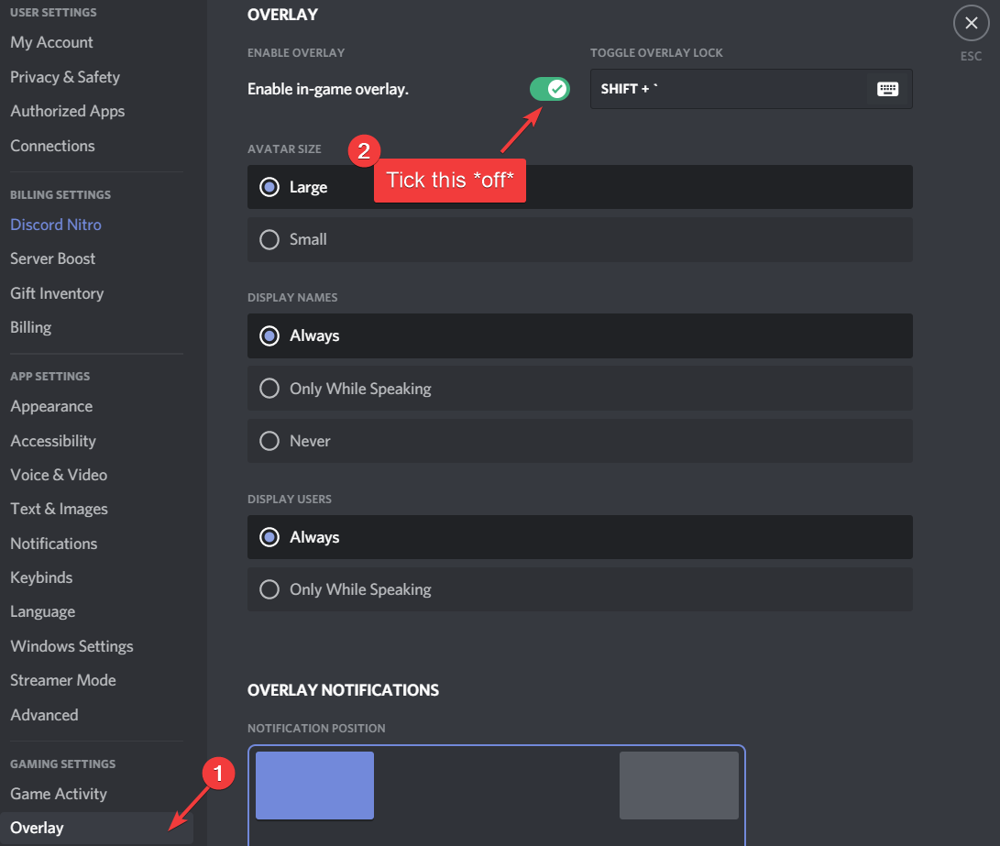
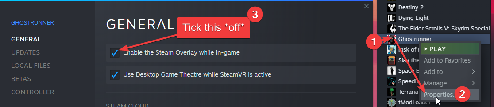
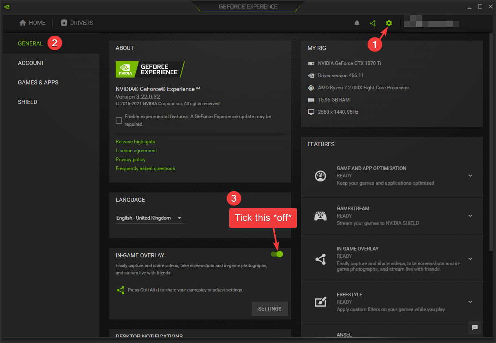

# Troubleshooting crashes
Ghostrunner is prone to crashing, we are uncertain what exactly causes those issues, but so far it seems to be linked to graphics drivers to an extent.

- [Troubleshooting crashes](#troubleshooting-crashes)
  - [Troubleshooting steps](#troubleshooting-steps)
    - [Ensure your drivers are up-to-date!!!](#ensure-your-drivers-are-up-to-date)
    - [Do NOT overclock](#do-not-overclock)
    - [Lower your graphics settings](#lower-your-graphics-settings)
    - [Do not alt-tab the game](#do-not-alt-tab-the-game)
    - [Disable all overlays](#disable-all-overlays)
  - [Disable third party crapware](#disable-third-party-crapware)

## Troubleshooting steps
As we do not know the source of crashes, these steps cannot guarantee a crash-free experience, but they can help reduce the number of variables to worry about when looking for the source of crashing. This can help you, but also the developers if reporting bugs and providing information.

### Ensure your drivers are up-to-date!!!
This should be your priority regardless, you should always strive to have latest system updates (on Windows that excludes Feature updates, but cumulative and security updates should NOT be delayed ever, do not fall for that trap) and driver updates especially. Nvidia and AMD release drivers that are optimised for newly released games. A lot of issues on release were people neglecting to update drivers, many crashes and failed boots were fixed by simply keeping GPU drivers up-to-date. 

Only latest drivers are supported!

### Do NOT overclock
Even today, many games simply do not handle overclocked PCs well, sometimes lending you worse performance than stock or outright crashing. When trying to solve your crashes, it might be a good idea to ensure no overclock is running. At the very least ensure your GPU is running at stock clocks and voltage, but putting your CPU and RAM at stock values might help too. 

### Lower your graphics settings
Sometimes just because you CAN run the game at certain settings, doesn't mean it will work long-term. If you are not running the game on low/medium settings, try lowering them. That will increase stability and may in turn reduce the odds of crashing.

### Do not alt-tab the game
Windows does not handle fullscreen applications very well. Especially when you are leaving fullscreen by tabbing out and using a different application. Try to do that less or never if you have the tendency to alt-tab. This is known to cause games to crash in general, not just Ghostrunner. It's game dependant, but it's good practice to not forcefully leave fullscreen.

### Disable all overlays
This again is good practice anyway, but has shown to help with Ghostrunner especially. Majority of overlays are poorly coded crapware that can cause slowdowns, crashes and unexpected behaviour in general. If you do not need an overlay, do not use it. If you can live without one sometimes, disable it while playing Ghostrunner. 

Overlays can include, but are not limited to:
- The discord overlay, here is how to disable it:
  

    
 Expand me for instructions! 

    
  

- Steam overlay, here is how to disable it only for Ghostrunner:
    

    
 Expand me for instructions! 

    
    

- GeForce Experience overlay, here is how to disable it:
    

    
 Expand me for instructions! 

    
    

- Razer Synapse Stats, here is how to disable it:
    

    
 Expand me for instructions! 

    
    1. Double-click the Synapse icon Synapse_icon.png
    2. Click on Stats
    3. In the new window, click on the Settings icon in the top right
    4. Set "Data Tracking" to Off
    5. Click OK when prompted
    

## Disable third party crapware
Typical Windows installations come pre-installed with tons of third party bloatware, especially common with laptops and prebuilts, where software related to some features of the hardware comes with the included Windows installation or gets installed automatically on first launch. 

It is not uncommon for those poorly written applications to cause slowdowns, crashes, freezes, etc. in many games and other applications. Ghostrunner is no exception, often times disabling or uninstalling said third party bloatware would fix the game not starting or crashing randomly.

Third party bloatware can include:
- RGB control software (Those especially caused issues for players)
- System "cleanup" or "speedup" software (placebo/useless in most cases and can be harmful)
- Various other utilities from laptop/prebuilt manufacturer
- Third party antivirus (eg. Norton, McAfee)

I would recommend uninstalling everything that comes pre-installed and avoid using third party software from the manufacturer unless you REALLY need it. Disabling it during gameplay can be ok, but there were cases where just having some of it installed would cause issues.